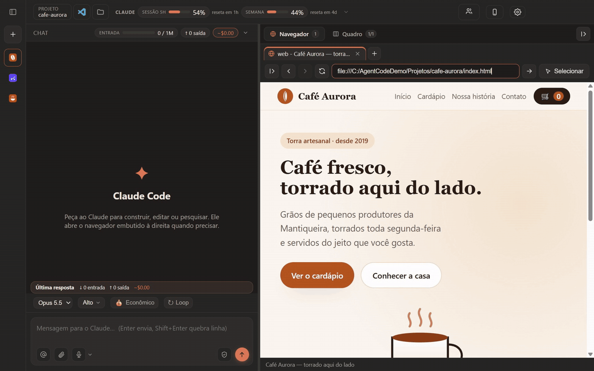
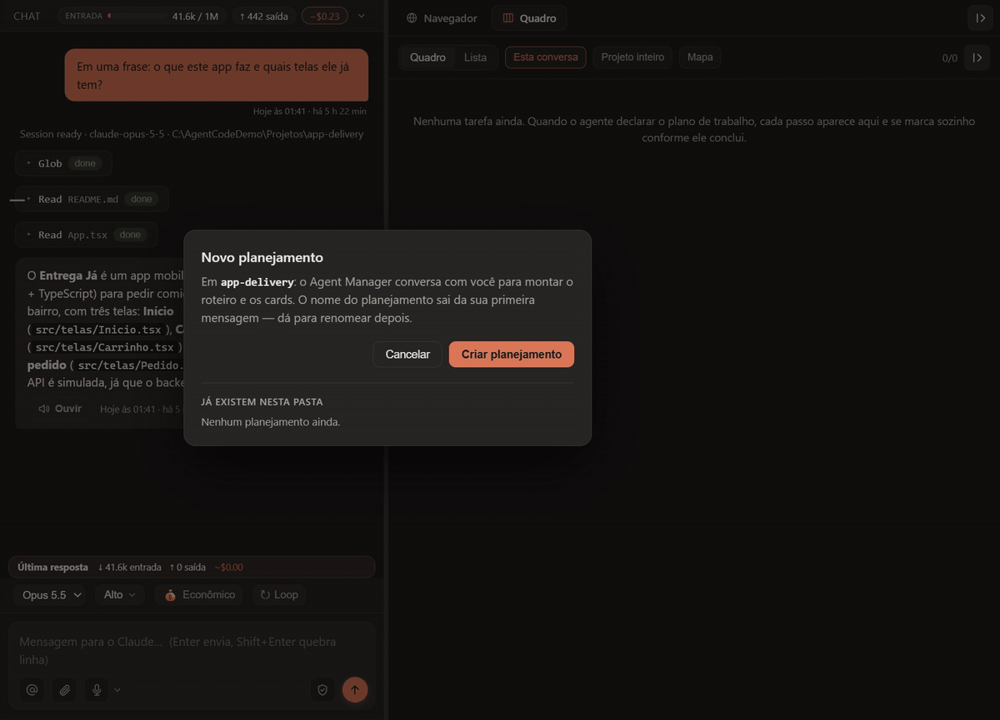
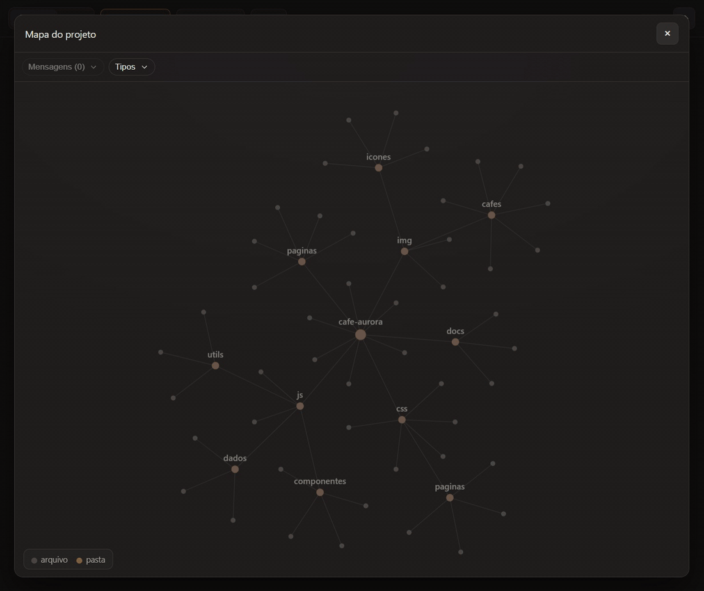
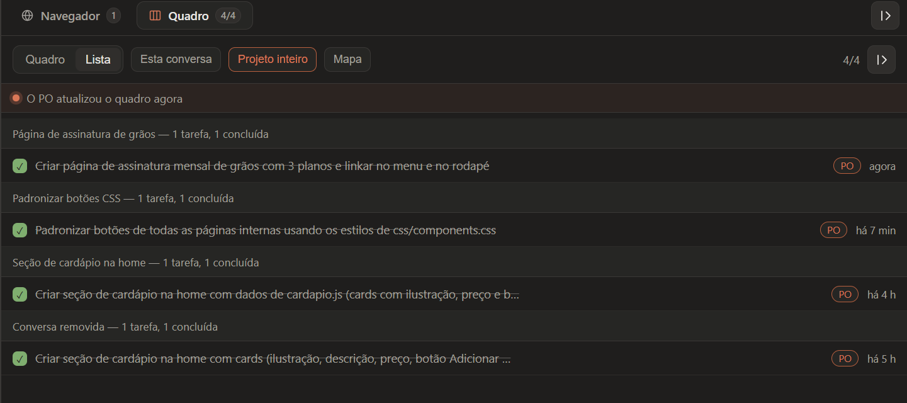
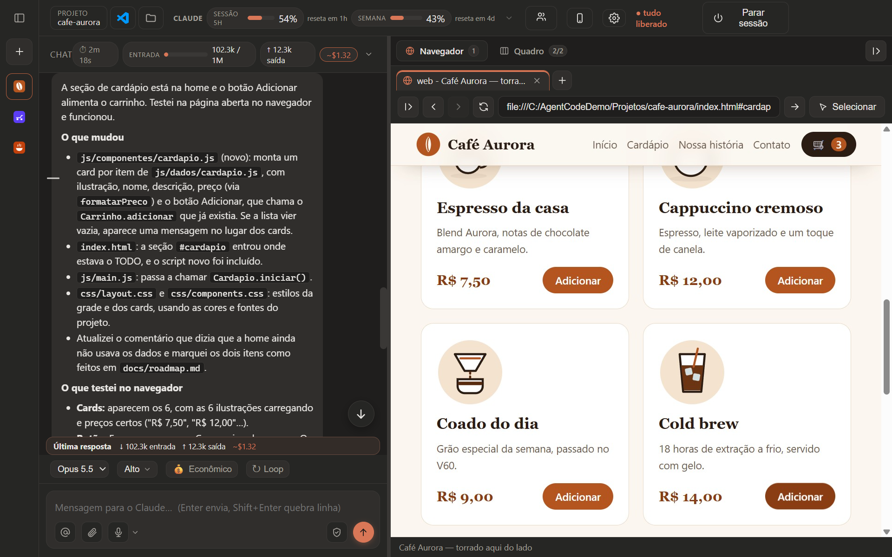

<h1 align="center">Agent Code</h1>

  <b>Você pede. Ele faz. E você vê cada passo acontecendo.</b>

  Um app para Windows que dá ao <b>Claude Code</b> a interface que ele merecia: 
  chat, um navegador que o próprio agente usa, planejamento visual, quadro de tarefas e o mapa do seu projeto — tudo numa janela só.

  
  
  

  

Gravação real, só acelerada nos trechos parados: o agente cria o cardápio de um site de cafeteria fictício, abre no navegador ao lado e testa o carrinho.

---

## 💬 Converse de um lado, veja o resultado do outro

Você escreve o que quer em português. O agente lê o projeto, escreve o código, **abre o resultado no navegador ao lado e testa sozinho** — e cada ação dele aparece como um cartão no chat, para você acompanhar sem ler log.

Medidor de contexto e estimativa de gasto, nível de esforço, fila de mensagens, rascunho que não se perde, "Tentar de novo" em um clique e perguntas do agente com opções clicáveis. Escolha entre **Opus 5.5**, **Sonnet 5** e **Fable 5.1** — ou deixe no **Automático** (com uma chave TypeSafe).

## 🧭 Planeje antes de construir

A tela mais bonita do app. Clique em **Novo planejamento**, conte a ideia e o **Agent Manager** monta o roteiro com você: questiona, pesquisa e vai registrando tudo num canvas — **uma coluna por etapa**, com cards de requisito, decisão, sugestão (com a fonte), ambiguidade e nota, ligados entre si.

Enquanto houver ambiguidade aberta, nada segue adiante. Quando o plano fechar, **Enviar para implementação** abre uma conversa nova que executa o roteiro etapa por etapa. E o plano fica salvo dentro do seu projeto, em `docs/spec/`, pronto para ir junto no git.

  

Um pedido, quatro etapas, catorze cards nascendo ao vivo — e um deles aberto no editor no final.

## 🗺️ Veja onde o agente está mexendo

No **Mapa do projeto**, cada pasta é um nó e cada arquivo, um ponto. Quando o agente age, **um rastro de luz corre até o arquivo**, o ponto acende na cor da ação (procurou, leu, editou, web) e um balão conta o que está sendo feito. Arquivo novo se monta na tela; arquivo apagado se desfaz.

Mostra os 100 arquivos mexidos mais recentemente, com filtros por mensagem e por tipo.

  

## ✅ Um quadro que se arruma sozinho

O **Quadro** mostra o trabalho em **A fazer · Fazendo · Concluído** (ou em lista), só desta conversa ou do projeto inteiro. Um **PO** acompanha o agente: confere o que foi feito e corrige ou cria cartões, sempre dizendo o porquê. Arraste um cartão para "Fazendo" e o agente começa.

  

## 🌐 Um navegador que o agente usa de verdade

É um **Chrome real** dentro do app, com perfil próprio por conversa. O agente abre páginas, clica, digita, lê e tira print — e você vê tudo ao vivo (no GIF lá de cima, é ele quem testa o botão "Adicionar"). Viu algo errado na página? Clique em **Selecionar**, aponte o elemento e ele vai direto para o chat.

  

---

## ✨ E tem mais

| | |
| --- | --- |
| 🧠 **Memória que fica** | O que vale lembrar vira nota em `.md` numa pasta sua — o Memorista anota sozinho. |
| 👀 **Vigia** | Opcional: levanta as premissas que só você sabe responder, antes que virem retrabalho. |
| 🔐 **Cofre de senhas** | Senhas ficam guardadas num cofre cifrado. |
| 🎙️ **Voz** | Dite a mensagem e ouça as respostas em voz alta (com sua chave OpenAI). |
| 📱 **Controle pelo celular** | App Android pareado por QR: acompanhe, mande texto e imagem, aprove permissões, pare o agente. |
| 🤖 **Preview Android** | O agente roda seu app num emulador ou aparelho, dentro de uma moldura de celular. |
| 🔁 **Loop** | Repete o pedido até uma condição ser atendida (até 100 ciclos). |
| 💸 **Econômico** | Respostas mais enxutas quando você só quer o essencial. |
| ⚡ **Várias conversas em paralelo** | Cada uma com seu histórico, com busca, organizado por projeto. |
| 📎 **Anexe qualquer coisa** | Imagem, PDF, planilha, zip, código — colando, arrastando ou pelo botão. |
| ⬇️ **Entregáveis com botão Baixar** | APK, PDF, zip: o que o agente gera vira download no chat. |
| 🧩 **Skills** | Digite `/` e use as skills do seu kit. |
| 🦙 **Outros modelos** | GPT pelo login do ChatGPT (experimental) e Ollama Cloud com a sua chave. |
| 🖥️ **Controle do Windows** | Opcional: o agente opera outros programas do PC por você. |

---

## 🚀 Comece em 1 minuto

1. **Clone** este repositório ou baixe o ZIP (botão **Code → Download ZIP**).
2. Dê **duplo clique no `start.bat`**. Na primeira vez ele instala tudo sozinho e abre o app.
3. **Entre com a sua conta Claude** quando o app pedir. Pronto.

**O que você precisa**

- Windows 10 ou 11 (64 bits)
- [.NET SDK 8 ou mais novo](https://dotnet.microsoft.com/download) — o `start.bat` compila um componente do app e não abre sem ele
- Uma conta [Claude](https://claude.ai)
- Node.js não é obrigatório: se faltar, o `start.bat` baixa uma cópia portátil

Prefere um instalador?

Gere o seu com `npm run package:win` — o resultado sai em `dist/`.

## 🛠️ Para devs

Electron + React + TypeScript sobre o **Claude Agent SDK**, com Playwright no navegador embutido. Roda nativo no Windows, sem WSL.

- [docs/ARQUITETURA.md](docs/ARQUITETURA.md) — como o app funciona por dentro.
- [docs/REFERENCIA.md](docs/REFERENCIA.md) — referência arquivo por arquivo.

© Larcher Tech

